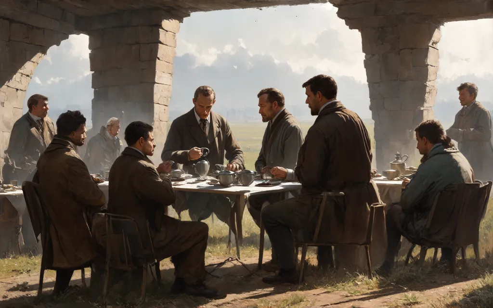

# Capstone
𝘛𝘦𝘢 𝘥𝘳𝘪𝘯𝘬𝘪𝘯𝘨 𝘪𝘯 𝘔𝘺𝘵𝘪𝘴𝘩𝘤𝘩𝘪, 𝘯𝘦𝘢𝘳 𝘔𝘰𝘴𝘤𝘰𝘸

# My Prompt

Lord of the flies, feral, jungle, eloi, dune, ruins, Hoods, children, Futuristic, apocalypse, robots, cyberpunk, robes, mos eisley, Photorealistic, sci-fi, future, ruins, encampment, benjamin vnuk, political art, van, outdoor scene Vasily Perov, “Tea drinking in Mytishchi, near Moscow”, "tea time", sci-fi, futuristic,  future city, photorealistic,  surreal , a painting of a group of people gathered around a table, an oil on canvas painting, shutterstock, american scene painting, russian village, begging for alms, the magician, kettle, shishkin, encampment, benjamin vnuk, political art, van, outdoor scene Чаепитие в Мытищах, близ Москвы, Vasily Perov, “Tea drinking in Mytishchi, near Moscow”, "tea time", outdoor, wide walls, flat stone, sandstone, indoor hall, ruins, single light source,  stone walls, a painting of a group of people gathered around a table,  "realism art movement", renaissance, photograph. beautiful, stunning, rule of thirds, an oil on canvas painting, dark, high contrast, photorealistic, hyper-realistic, provia, shutterstock, american scene painting, russian village, begging for alms, the magician, kettle, shishkin, encampment, benjamin vnuk, political art, van, outdoor scene, Чаепитие в Мытищах, близ Москвы, sci fi, cybernetic, futuristic city, Чаепитие в Мытищах, близ Москвы,Vasily Perov, “Tea drinking in Mytishchi, near Moscow”, "tea time", dune, foundation, ("Third Class Carriage" by Honoré Daumier), handmaiden's tale, post-apocalyptic, medieval, nostalgia, provia, Galactromeda, HAPLOPRAXIS

## Negative Prompt

Ugly, distorted, garish, gawdy, amateur, abstract 

## Other Settings

Width: 1024
Height: 640

Number of inference steps: 43
Guidance scale: 5

Model: Stable Diffusion 3 Medium
